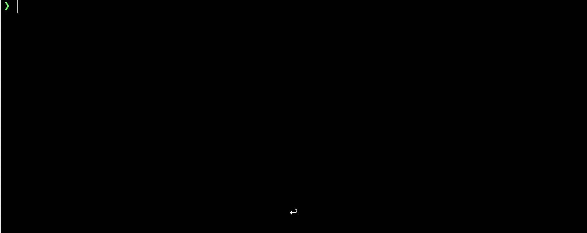

# douban-star-photo-cli

一个可以根据豆瓣影人 id 下载影人全部图片的工具

## 示例



## 使用

执行

```bash
$ douban-star-photo [PATH]
```

`PATH` 为图片要保存的路径，例如

```bash
$ douban-star-photo ~/Pictures/hello
```

回答下列问题：

1. 影人的 id
2. 是否忽略已经存在的图片，默认为 `是`

然后开始下载

## 影人 id 获取

可直接从浏览器地址栏中获取，例如

```
https://movie.douban.com/celebrity/1364848/photos
```

上述地址中的影人 id 为 `1364848`
